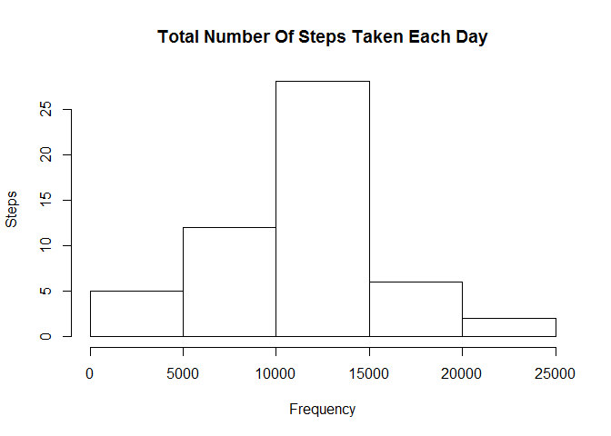
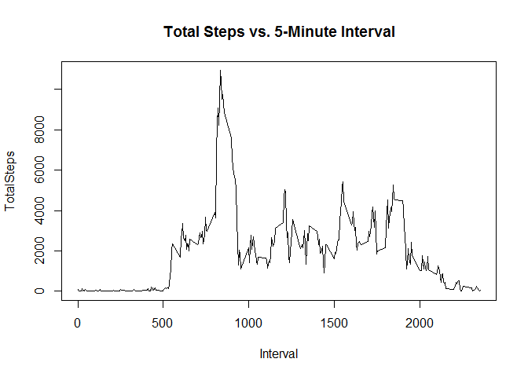
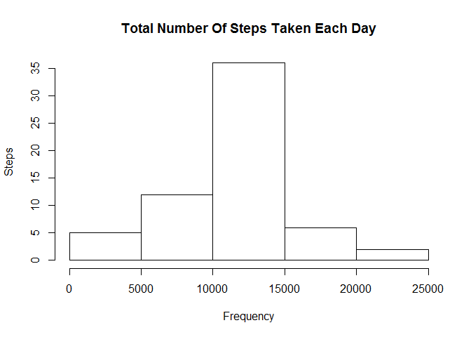
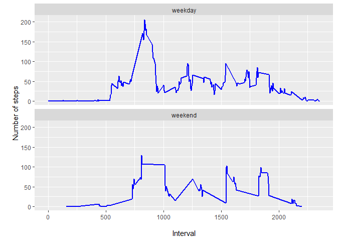

### Loading and preprocessing the data


```r
unzip("activity.zip")
Z <- read.csv("activity.csv")
head(Z)
```

```
##   steps       date interval
## 1    NA 2012-10-01        0
## 2    NA 2012-10-01        5
## 3    NA 2012-10-01       10
## 4    NA 2012-10-01       15
## 5    NA 2012-10-01       20
## 6    NA 2012-10-01       25
```
### What is mean total number of steps taken per day?
#### 1. Make a histogram of the total number of steps taken each day
For this part of the assignment, you can ignore the missing values in
the dataset


```r
ne<- aggregate(steps ~ date,Z, FUN=sum)
head(ne)
```

```
##         date steps
## 1 2012-10-02   126
## 2 2012-10-03 11352
## 3 2012-10-04 12116
## 4 2012-10-05 13294
## 5 2012-10-06 15420
## 6 2012-10-07 11015
```


```r
hist(ne$steps,
     xlab = "Frequency", 
     ylab = "Steps",
     main = "Total Number Of Steps Taken Each Day")
```

<!-- -->

#### 2. Calculate and report the **mean** and **median** total number of steps taken per day


```r
meann <- mean(ne$steps)
median <- median(ne$steps)
meann
```

```
## [1] 10766.19
```

```r
median 
```

```
## [1] 10765
```
The mean is *10766.19* and median is *10765*.

### What is the average daily activity pattern?

#### 1. Make a time series plot (i.e. `type = "l"`) of the 5-minute interval (x-axis) and the average number of steps taken, averaged across all days (y-axis)


```r
int<- aggregate(steps ~ interval,Z, FUN = sum)

plot(int$interval, int$steps,type = "l",xlab = "Interval",ylab = "TotalSteps",
     main = "Total Steps vs. 5-Minute Interval")
```

<!-- -->


#### 2. Which 5-minute interval, on average across all the days in the dataset, contains the maximum number of steps?


```r
filter(int, steps==max(steps))
```

```
##   interval steps
## 1      835 10927
```

### Imputing missing values

Note that there are a number of days/intervals where there are missing
values (coded as `NA`). The presence of missing days may introduce
bias into some calculations or summaries of the data.

#### 1. Calculate and report the total number of missing values in the dataset (i.e. the total number of rows with `NA`s)


```r
table(is.na(Z))
```

```
## 
## FALSE  TRUE 
## 50400  2304
```
The total number of missing values in the dataset *2304*

#### 2. Devise a strategy for filling in all of the missing values in the dataset. The strategy does not need to be sophisticated. For example, you could use the mean/median for that day, or the mean for that 5-minute interval, etc.


```r
internew<- aggregate(steps~interval,Z,FUN=mean)
Znew <- merge(x=Z, y=internew, by="interval")
Znew$steps <- ifelse(is.na(Znew$steps.x), Znew$steps.y, Znew$steps.x)
```

#### 3. Create a new dataset that is equal to the original dataset but with the missing data filled in.

```r
Znew <- select(Znew, steps, date, interval)
head(Znew)
```

```
##      steps       date interval
## 1 1.716981 2012-10-01        0
## 2 0.000000 2012-11-23        0
## 3 0.000000 2012-10-28        0
## 4 0.000000 2012-11-06        0
## 5 0.000000 2012-11-24        0
## 6 0.000000 2012-11-15        0
```

#### 4. Make a histogram of the total number of steps taken each day and Calculate and report the **mean** and **median** total number of steps taken per day. Do these values differ from the estimates from the first part of the assignment? What is the impact of imputing missing data on the estimates of the total daily number of steps?


```r
stepsnew<- aggregate(steps ~ date, Znew, FUN=sum)

#Histogram for new dataset
hist(stepsnew$steps,
     xlab = "Frequency", 
     ylab = "Steps",
     main = "Total Number Of Steps Taken Each Day")
```

<!-- -->

```r
nmean <- mean(stepsnew$steps)
nmedian <- median(stepsnew$steps)
x<-round(nmean - meann,2)
x
```

```
## [1] 0
```

```r
x1<-round(nmedian - median,2)
x1
```

```
## [1] 1.19
```
The difference  in mean is *0* and meadian is *1.19*

### Are there differences in activity patterns between weekdays and weekends?

 For this part the `weekdays()` function may be of some help here. Use the dataset with the filled-in missing values for this part.

#### 1. Create a new factor variable in the dataset with two levels -- "weekday" and "weekend" indicating whether a given date is a weekday or weekend day.

```r
library(chron)
```

```
## NOTE: The default cutoff when expanding a 2-digit year
## to a 4-digit year will change from 30 to 69 by Aug 2020
## (as for Date and POSIXct in base R.)
```

```r
Znew$dayofweek <- ifelse(is.weekend(Z$date), "weekend", "weekday")
head(Znew)
```

```
##      steps       date interval dayofweek
## 1 1.716981 2012-10-01        0   weekday
## 2 0.000000 2012-11-23        0   weekday
## 3 0.000000 2012-10-28        0   weekday
## 4 0.000000 2012-11-06        0   weekday
## 5 0.000000 2012-11-24        0   weekday
## 6 0.000000 2012-11-15        0   weekday
```

#### 2. Make a panel plot containing a time series plot (i.e. `type = "l"`) of the 5-minute interval (x-axis) and the average number of steps taken, averaged across all weekday days or weekend days (y-axis). The plot should look something like the following, which was created using **simulated data**:

```r
meanintnew<- aggregate(steps ~ interval + dayofweek,Znew, FUN=mean)
head(meanintnew)
```

```
##   interval dayofweek     steps
## 1        0   weekday 1.7169811
## 2        5   weekday 0.3396226
## 3       10   weekday 0.1320755
## 4       15   weekday 0.1509434
## 5       20   weekday 0.0754717
## 6       25   weekday 2.0943396
```

```r
#Time series Plot
library(ggplot2)
ggplot(meanintnew, aes(x=interval, y=steps))+facet_wrap(~dayofweek, nrow=2) +geom_line(color="blue", size=1) + labs(x="\nInterval", y="\nNumber of steps")
```

<!-- -->


